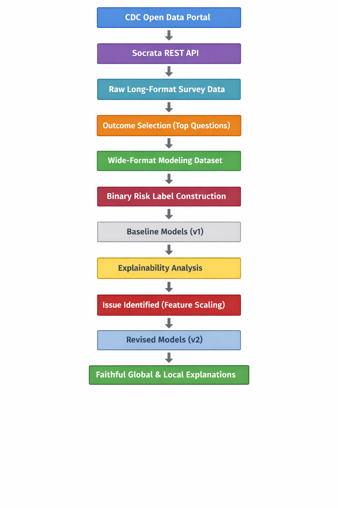
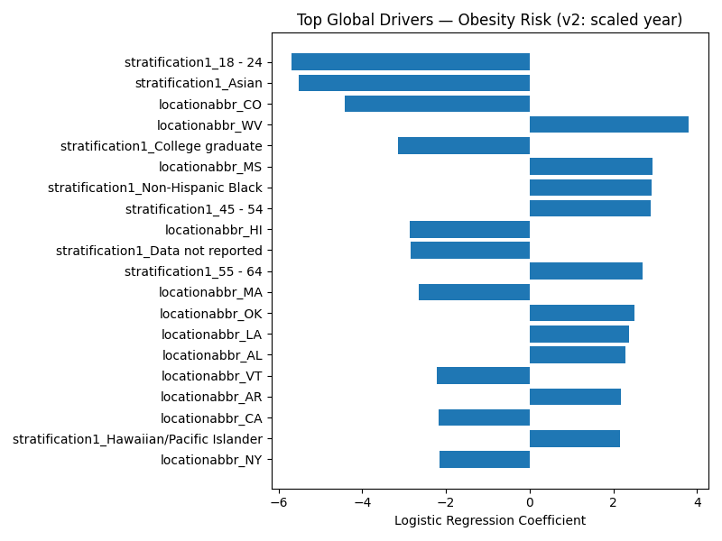
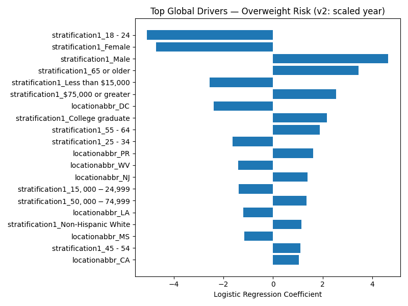
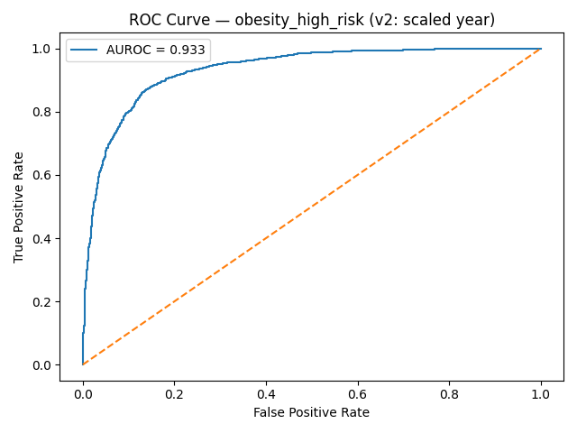
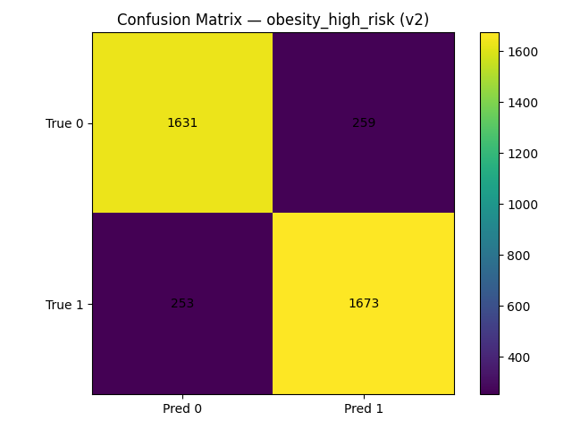
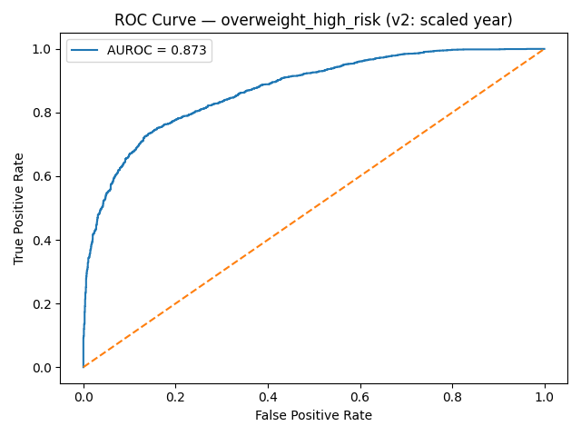
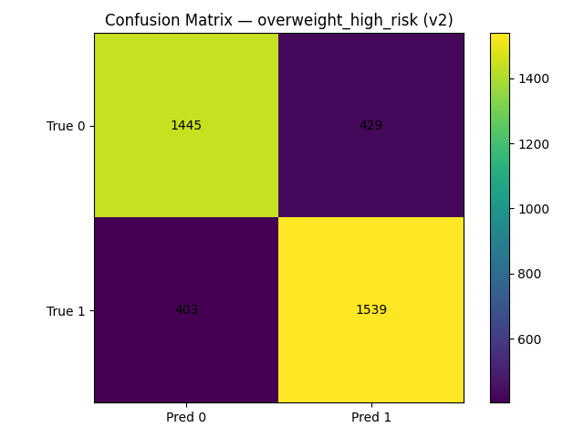

# Explaining Clinical Outcomes  
**A Reproducible, Human-Centered Explainable AI Pipeline for Public Health Risk Modeling**

## Project Description

This repository implements an end-to-end, script-based machine learning workflow for **modeling and explaining clinical/public health outcomes** using population-level survey data from the CDC Open Data Portal. The project emphasizes **explainability** and **reproducibility**: every stage of the pipeline is explicit (data acquisition → profiling → dataset construction → modeling → explanation), and each stage produces inspectable artifacts such as datasets, trained models, plots, and explanation tables.

Two related outcomes, **obesity prevalence** and **overweight prevalence** are modeled using a shared feature space. The repository includes both baseline and revised modeling variants to demonstrate how explainability can reveal methodological issues (e.g., feature scaling) and motivate corrected, more interpretable models.

Rather than operating at the level of individual patients, this project works at the level of **population subgroups**. Each data point represents a specific subgroup defined by attributes such as state, year, age range, income bracket, education level, or sex. Predictions therefore answer questions for example:

> *“For adults aged 25–34 in Minnesota in 2024, what is the estimated risk of obesity, and what factors most strongly influenced that estimate?”*

This framing makes the project well suited for demonstrating **local explanations**: explanations that clarify *why a specific subgroup* received a particular risk prediction, rather than explaining the model only in aggregate.

## Problem Statement

Machine learning models are popularly used to support decisions in **clinical and public health contexts**, where predictions influence policy, funding allocation, and targeted interventions. In such settings, predictive performance alone is insufficient. Stakeholders need to understand why a model produces a given output, whether model behavior is stable and defensible, and how conclusions may change under different modeling assumptions.

The central goal of this project is to demonstrate a practical, research-oriented approach to explainable risk modeling by:

- Building transparent models that are interpretable by design (rather than opaque black-box predictors)
- Producing global explanations (what factors matter overall) and local explanations (why a specific subgroup receives a particular risk estimate)
- Treating explainability as a diagnostic tool that can surface modeling flaws and drive iteration, rather than as a post-hoc visualization step
- Structuring the work as a reproducible codebase that others can run end-to-end and verify independently

## Research Questions

This project explores the following research questions:

1. How do demographic and socioeconomic stratifications influence obesity and overweight risk at the population subgroup level?
2. Can two closely related clinical outcomes be modeled using a shared feature space while remaining interpretable?
3. How do preprocessing choices (e.g., feature scaling) affect the **validity and stability of explanations**, even when predictive performance appears strong?
4. How can both global (population-level) and local (subgroup-level) explanations be presented in a way that supports human understanding and trust?

These questions guide both the modeling approach and the explainability analyses presented in the repository.

## Project Workflow and Process

This project was developed incrementally, with each stage informing the next. The workflow was intentionally designed to mirror how explainable AI systems are built and audited in real-world research and applied settings.

At a high level, the pipeline progresses from raw public health survey data to interpretable, subgroup-level explanations through a sequence of explicit, reproducible steps.

<p align="center">
  
</p>

Each block in the diagram corresponds to one or more scripts in the repository and produces concrete artifacts that are saved to disk (datasets, models, figures, and tables).

### Step 1: Programmatic Data Access

The workflow begins by accessing CDC BRFSS data programmatically using the **Socrata REST API**. Rather than manually downloading static files, the data is retrieved via API calls to ensure that:

- The process is reproducible
- Query parameters are explicit and auditable
- The pipeline can be extended to other CDC outcomes with minimal changes

Early API access and validation are implemented to confirm connectivity and data availability.

### Step 2: Data Profiling and Type Inspection

Raw data returned by the API arrives primarily as strings, even for numeric quantities such as prevalence estimates, confidence intervals, and sample sizes. Before modeling, the data is profiled to:

- Inspect available columns and schema
- Identify which fields are numeric versus categorical
- Detect missing values and inconsistent representations
- Understand how different subgroup stratifications are encoded

This step ensures that later modeling decisions are grounded in an accurate understanding of the data.

### Step 3: Outcome Selection

The CDC dataset contains thousands of rows spanning many different survey questions. Rather than arbitrarily selecting an outcome, the workflow explicitly:

- Counts how frequently each survey question appears
- Identifies the most commonly reported outcomes
- Selects two related, high-coverage clinical outcomes:
  - Obesity prevalence
  - Overweight prevalence

This selection ensures sufficient data coverage and supports meaningful comparative analysis.

### Step 4: Dataset Construction (Long → Wide Transformation)

CDC survey data is provided in long format, where each row corresponds to a single outcome for a specific subgroup. Machine learning models, however, require one row per decision context.

To address this, the data is reshaped into wide format, where:

- Each row represents a single population subgroup
- Columns represent subgroup attributes and outcome values
- Obesity and overweight outcomes are aligned within the same row

#### Example: Long Format Data

| year | state | stratification | question | value |
|-----:|:-----:|:--------------:|:---------|------:|
| 2024 | MN | Age 25–34 | Obesity prevalence | 31.3 |
| 2024 | MN | Age 25–34 | Overweight prevalence | 32.7 |
| 2024 | MN | Age 35–44 | Obesity prevalence | 34.1 |
| 2024 | MN | Age 35–44 | Overweight prevalence | 36.2 |

In this format:
- Each subgroup appears multiple times
- Outcomes are spread across rows
- There is no single row representing a complete decision context

Machine learning models, however, require **one row per decision instance**.

---

#### Example: Wide Format Data (Modeling-Ready)

| year | state | stratification | obesity_value | overweight_value |
|-----:|:-----:|:--------------:|--------------:|-----------------:|
| 2024 | MN | Age 25–34 | 31.3 | 32.7 |
| 2024 | MN | Age 35–44 | 34.1 | 36.2 |

Binary risk labels are then constructed using median prevalence thresholds, producing balanced classes suitable for interpretation.

For example:
- Subgroups with obesity prevalence above the median are labeled as *high risk*
- Subgroups below the median are labeled as *lower risk*

This approach:
- Produces balanced classes
- Avoids arbitrary clinical cutoffs
- Facilitates clear interpretation of model outputs

The resulting dataset is saved as `data/obesity_overweight_modeling.csv` and serves as the input to all downstream modeling and explainability steps.

### Step 5: Baseline Modeling (v1)

Baseline logistic regression models are trained separately for obesity and overweight risk. Logistic regression was chosen intentionally because it:

- Is interpretable by design
- Produces exact, coefficient-based explanations
- Avoids reliance on black-box approximations

At this stage (v1), numeric features such as survey year are included without scaling. These models achieve strong predictive performance but serve primarily as a baseline for explainability analysis.

### Step 6: Explainability-Driven Model Diagnosis

Global and local explanations are generated for the baseline models. During local explanation analysis, it becomes clear that:

- Certain numeric features dominate predictions due to scale
- Explanations are numerically unstable, even when accuracy metrics are strong

This step demonstrates the role of explainability as a diagnostic tool, revealing modeling issues that are not apparent from performance metrics alone.

### Step 7: Revised Modeling (v2)

To address the issues identified through explainability, revised models (v2) are trained with corrected preprocessing:

- Numeric features are standardized
- Categorical features remain one-hot encoded
- All other modeling choices remain unchanged

This controlled revision allows direct comparison between v1 and v2 models, isolating the impact of preprocessing on both performance and interpretability.

### Step 8: Faithful Global and Local Explanations

Final global and local explanations are generated from the revised models. These explanations:

- Are numerically stable
- Align with domain intuition
- Clearly attribute risk to subgroup characteristics
- Support both population-level and subgroup-level reasoning

This completes the end-to-end explainable modeling pipeline.


## Repository Files and Their Roles

This repository is intentionally organized to make each modeling and explainability step explicit and reproducible. Rather than placing all logic in a single script or notebook, functionality is separated into modular files that each serve a clear purpose within the overall pipeline.

Below, the role of each major directory and script, along with the reasoning behind their inclusion are described:

---

### `src/` — Core Utilities and Data Access

The `src/` directory contains reusable components that support the rest of the pipeline.

- **`data_cdc.py`**  
  Encapsulates all logic related to accessing the CDC Open Data Portal via the Socrata REST API. This includes query construction, pagination handling, and response normalization. Centralizing API logic ensures consistency and simplifies reuse across scripts.

- **`inspect_data.py`**  
  Provides utilities for inspecting raw data schemas, column availability, and basic data characteristics. This file supports early-stage understanding of the dataset before modeling decisions are made.

---

### `test_api.py` — API Sanity Checks

- **`test_api.py`**  
  A lightweight script used to verify connectivity to the Socrata API and inspect raw responses. This script was used early in development to confirm:
  - Successful API access
  - Expected response structure
  - Presence of key fields

While not part of the main pipeline, this script serves as an important validation step when working with third party data sources.

---

### `scripts/` — End-to-End Pipeline Execution

The `scripts/` directory contains executable steps that together form the full workflow.

#### Data Profiling and Outcome Selection

- **`01_profile_cdc_data.py`**  
  Profiles the raw CDC dataset to understand schema, missingness, and field distributions. Outputs a summary artifact (`stage01_profile_summary.json`) used to guide downstream decisions.

- **`02_list_questions.py`**  
  Enumerates and counts survey questions in the dataset to identify the most frequently reported outcomes. This script motivated the selection of obesity and overweight prevalence as the primary modeling targets.

---

#### Dataset Construction (Exploration & Preprocessing)

- **`03_build_outcome_dataset.py`**  
  Constructs the modeling-ready dataset by:
  - Filtering to the selected outcomes
  - Converting numeric fields from string representations
  - Reshaping the data from long to wide format
  - Aligning obesity and overweight outcomes within the same subgroup rows
  - Creating binary risk labels using median thresholds

The output is saved as `data/obesity_overweight_modeling.csv`.

---

#### Baseline Modeling (v1)

- **`04_train_obesity_classifier.py`**  
  Trains a baseline logistic regression model for obesity risk using one-hot encoded categorical features and an unscaled numeric year feature.

- **`05_train_overweight_classifier.py`**  
  Analogous baseline model for overweight risk.

These scripts establish a performance baseline and generate standard evaluation plots (ROC curves and confusion matrices).

---

#### Explainability and the v1 Anomaly

- **`06_global_explain_obesity.py`** and **`08_local_explain_obesity.py`**  
  Generate global and local explanations for the baseline obesity model.

During **local explanation analysis**, a critical anomaly was observed:

- The numeric feature `yearstart` contributed **on the order of hundreds of log-odds units** (≈ +600)
- The model intercept was approximately −600
- Predictions were effectively determined by numerical scale rather than meaningful subgroup attributes

Although predictive performance was strong, these explanation magnitudes were **not interpretable or defensible**. This indicated that the raw numeric year feature was dominating the model purely due to scale.

This finding motivated a deliberate model revision.

---

#### Revised Modeling (v2): Addressing Explainability Issues

To correct the anomaly revealed by explainability:

- Numeric features (specifically `yearstart`) were standardized using `StandardScaler`
- All other modeling choices were held constant
- New scripts were introduced with a `_v2` suffix to preserve experimental traceability

Key revised scripts include:

- **`04_train_obesity_classifier_v2.py`**
- **`05_train_overweight_classifier_v2.py`**

These revised models achieved:
- Improved AUROC and accuracy
- Numerically stable coefficients
- Meaningful local explanations where subgroup attributes (age, income, geography) drive predictions rather than scale artifacts

---

#### Explainability (v2)

- **`06_global_explain_obesity_v2.py`**
- **`07_global_explain_overweight_v2.py`**
- **`08_local_explain_obesity_v2.py`**
- **`09_local_explain_overweight_v2.py`**

These scripts generate faithful global and local explanations from the revised models. In contrast to v1:

- Feature contributions are within reasonable magnitudes
- Intercepts are stable
- Local explanations align with domain intuition
- Differences between obesity and overweight drivers are interpretable

---

### `models/` — Trained Model Artifacts

Stores serialized model pipelines (`.joblib`) for both baseline (v1) and revised (v2) models. Keeping both versions enables direct comparison and reproducibility.

---

### `reports/` — Results and Artifacts

- **`reports/figures/`**  
  ROC curves, confusion matrices, and global importance plots.

- **`reports/tables/`**  
  CSV files containing ranked global feature importance values.

These artifacts are referenced throughout the analysis and can be inspected independently of the code.

---
 ### Explainability Anomalies Observed in Baseline Models (v1)

During local explainability analysis of the baseline (v1) models, several numerical anomalies were observed that indicated the explanations were **not faithful**, despite strong predictive performance. These anomalies were the primary motivation for introducing revised models (v2).

#### Obesity Model (v1)

In local explanations generated by `08_local_explain_obesity.py`, the following pattern was consistently observed:

- The numeric feature `yearstart` contributed approximately **+600 to +650 log-odds units**
- The model intercept was approximately **−630 log-odds units**
- The final prediction resulted from near-cancellation of these two large values

Example (representative):

- Base intercept: ≈ −633  
- Contribution from `yearstart`: ≈ +634  
- Contributions from all other features: typically < |1|  

This indicates that the model’s decision was dominated by the **numerical scale** of the year feature rather than by meaningful subgroup characteristics such as age, income, education, or geography.

Although the resulting probability appeared reasonable, the explanation itself was **not interpretable** and did not support defensible reasoning.

---

#### Overweight Model (v1)

A similar issue was observed in the baseline overweight model:

- `yearstart` again contributed **hundreds of log-odds units**
- The intercept offset these contributions
- Subgroup-level categorical features played a negligible role in local explanations

As with the obesity model, predictive metrics (AUROC and accuracy) remained strong, masking the underlying issue.

---

#### Why This Was a Problem

These magnitudes are problematic because:

- Logistic regression coefficients are intended to represent *relative influence*
- Contributions on the order of hundreds overwhelm all other signals
- Explanations become artifacts of preprocessing rather than reflections of real relationships
- Human interpretation becomes impossible

Crucially, this issue **was not apparent from performance metrics alone** and only surfaced through local explainability analysis.

---

#### Resolution in v2

To address this issue:

- The numeric feature `yearstart` was standardized using `StandardScaler`
- All other modeling choices were held constant
- Revised models were trained and re-explained

In the v2 models:

- Feature contributions are within reasonable magnitudes (typically |0–3|)
- Intercepts are numerically stable
- Local explanations clearly attribute predictions to subgroup characteristics
- Predictive performance improved rather than degraded

This demonstrates the role of explainability as a diagnostic tool that can directly inform and improve modeling decisions.


Running version 2 after version 1 can demonstrates that:

- Explainability can surface modeling flaws invisible to accuracy metrics
- Model development is an iterative, diagnostic process

The idea behind the structure was to reflect how explainable AI systems are developed and reviewed in practice.


### Outcome Selection

Two related but distinct public health outcomes were selected for modeling:

1. Obesity prevalence  
   Percent of adults aged 18 years and older who have obesity

2. Overweight prevalence  
   Percent of adults aged 18 years and older who have an overweight classification

Outcome selection was operationalized in the script `scripts/02_list_questions.py`, which enumerates and ranks survey questions by frequency of occurrence across years, locations, and subgroup stratifications. This ensured that selected outcomes had sufficient coverage to support stable modeling and subgroup-level explainability.

#### Why these outcomes were selected

The two outcomes were chosen deliberately rather than arbitrarily:

- They are among the most frequently reported survey questions in the dataset, ensuring broad coverage across years, geographic regions, and demographic stratifications
- They are epidemiologically related but not identical, allowing meaningful comparison within a shared analytical framework
- Modeling both outcomes enables comparative explainability, revealing where learned risk drivers align and where they diverge
- Differences in contributing factors between obesity and overweight prevalence are clinically and socially meaningful in public health decision-making

Each outcome is modeled separately, but using an identical feature space and modeling pipeline. This design allows differences in results and explanations to be attributed to outcome-specific patterns rather than to changes in preprocessing or model structure.

---

### Modeling Approach

Logistic regression is used as the primary modeling method throughout this project. This choice reflects an emphasis on faithful and transparent explainability rather than on maximizing predictive complexity.

Logistic regression was selected because it:

- Produces interpretable coefficients that directly represent the direction and relative strength of feature influence
- Supports exact global and local explanations without reliance on post-hoc approximation methods
- Makes the relationship between features, log-odds, and predicted probabilities explicit and auditable

#### Feature Representation

Categorical subgroup attributes, such as geographic region, age group, income category, education level, and sex, are encoded using one-hot encoding. This ensures that each model coefficient corresponds to a specific, human-readable subgroup characteristic.

Numeric features are retained in continuous form. However, their treatment differs between modeling versions.

#### Numeric Feature Handling: v1 vs v2

In the baseline models (v1), numeric features, most notably the survey year, are included without scaling. While this preserves raw values, it implicitly assumes that feature scale does not affect interpretability.

Local explainability analysis revealed that this assumption was incorrect. The unscaled numeric feature dominated log-odds contributions due to magnitude alone, obscuring the influence of subgroup-level categorical attributes.

To address this issue, revised models (v2) standardize numeric features while holding all other modeling choices constant. This change ensures that numeric and categorical features operate on comparable scales and that coefficient magnitudes remain interpretable relative to one another.

Maintaining both v1 and v2 models allows the impact of this preprocessing decision to be examined explicitly and transparently.

---

This modeling setup establishes the foundation for the explainability analyses that follow, where both global and local explanations are used to interrogate model behavior and validate interpretability.


## Explainability Methods

Explainability is treated as a core methodological component of this project rather than as a post-hoc visualization step. Explanations are used both to understand model behavior and to diagnose modeling issues that are not visible from predictive performance alone.

### Global vs. Local Explainability

Two complementary forms of explanation are used throughout the analysis:

- Global explanations describe which features are most influential across the entire dataset.
- Local explanations describe why a specific population subgroup received a particular prediction.

Both are necessary to fully understand model behavior.

Global explanations answer questions such as:
Which subgroup attributes are most strongly associated with increased or decreased risk overall?

Local explanations answer questions such as:
Why did this specific subgroup receive this risk estimate, given its characteristics?

Relying on only one of these perspectives would provide an incomplete and potentially misleading picture.

### Global Feature Importance (Model-Level Explanations)

Global explanations summarize which subgroup attributes most strongly influence predicted risk across the entire dataset. These explanations are derived directly from the learned logistic regression coefficients and ranked by absolute magnitude.

#### Obesity Risk – Global Feature Importance (v2)

<p align="center">
  
</p>

*Figure: Ranked global feature importance for obesity risk (v2). Coefficient magnitudes indicate the relative influence of subgroup attributes on predicted obesity risk at the population level. Both protective and risk-increasing factors are visible, highlighting the multidimensional nature of obesity prevalence.*

---

#### Overweight Risk – Global Feature Importance (v2)

<p align="center">
  
</p>

*Figure: Ranked global feature importance for overweight risk (v2). While some drivers overlap with obesity risk, notable differences emerge in the relative influence of sex, age, and socioeconomic indicators, underscoring that the two outcomes are related but not interchangeable.*


---

### Technical Handling of Explainability

Because the CDC survey data is provided in long format, a pivot to wide format is required before explainability can be meaningfully applied. Local explanations assume a single, coherent decision instance; without wide-format restructuring, it would not be possible to attribute a prediction to a specific subgroup context.

After restructuring, explainability is handled directly through the trained logistic regression models:

- Global explanations are derived from model coefficients, ranked by absolute magnitude.
- Local explanations are computed by decomposing the predicted log-odds for a single subgroup into:
  - The model intercept
  - Feature-level contributions (coefficient × feature value)

This approach yields exact, faithful explanations that are fully aligned with model internals.

---

### Why Logistic Regression Instead of SHAP or LIME

Logistic regression was chosen intentionally to avoid reliance on approximation-based explainability methods.

While methods such as SHAP and LIME are powerful, they approximate model behavior and can introduce additional assumptions or variability. In contrast, logistic regression allows:

- Exact computation of feature contributions
- Transparent mapping from features to log-odds to probabilities
- Clear separation between modeling behavior and explanation logic

This makes explanations auditable and avoids conflating model uncertainty with explanation uncertainty.

---

### What Each Explanation Type Answers

Global explanations answer:
Which subgroup characteristics are most influential overall?
Are there consistent patterns across geography, age, income, or education?
How do these patterns differ between obesity and overweight risk?

Local explanations answer:
Why did this subgroup receive this prediction?
Which features increased or decreased risk for this subgroup?
How did numeric and categorical features interact in the final decision?

Together, these perspectives support both population-level insight and subgroup-level accountability.

---

## How to Read the Explanations (Reader Guidance)

This section provides guidance for interpreting the explanations produced by the models, particularly for readers without a machine learning background.

### Interpreting Global Coefficients

A positive coefficient indicates that the corresponding feature is associated with higher risk, holding other features constant.

A negative coefficient indicates that the feature is associated with lower risk.

The magnitude of the coefficient reflects the relative strength of the association, not a causal effect.

### Interpreting Local Contributions

A local contribution represents how much a specific feature increased or decreased the predicted log-odds for a given subgroup.

For example, a positive contribution from an age group indicates that belonging to that age group increased the predicted risk for that subgroup, relative to the model baseline.

Local explanations should be interpreted as descriptive, not causal. They explain what the model learned, not why the underlying real-world phenomenon occurs.

### What Not to Over-Interpret

Readers should avoid interpreting coefficients or contributions as causal claims.

Predictions are based on aggregated survey data and reflect correlations present in the data, not individual-level risk or intervention effects.

Local explanations describe model reasoning for a specific subgroup, not deterministic outcomes for individuals within that subgroup.

---

## Results

### Predictive Performance

Revised models (v2) achieved strong and stable predictive performance:


#### Obesity Risk

- AUROC: approximately 0.93  
- Accuracy: approximately 0.87  

<p align="center">
  
</p>

<p align="center">
  
</p>

#### Overweight Risk

- AUROC: approximately 0.87  
- Accuracy: approximately 0.78  

<p align="center">
  
</p>

<p align="center">
  
</p>

#### Interpretation

Performance improvements from v1 to v2 occurred despite minimal changes to model structure, indicating that corrected preprocessing improved both interpretability and predictive behavior.
The primary difference between versions was corrected preprocessing of numeric features informed by explainability analysis.

This indicates that improved preprocessing not only enhanced interpretability, but also led to more stable and generalizable predictive behavior. The results reinforce the central theme of this project: explainability can serve as a diagnostic tool that directly improves model quality, rather than merely accompanying final predictions.

---

### Insights from Global Explanations

Global explanations reveal consistent patterns across both outcomes, including:

- Strong age-related gradients in risk
- Clear associations with income and education levels
- Geographic variation across states

However, important differences emerge between outcomes:

- Obesity risk shows stronger associations with certain demographic stratifications
- Overweight risk exhibits more pronounced sex-based differences
- Some features act as protective factors for one outcome while increasing risk for the other

These differences suggest that obesity and overweight prevalence, while related, are driven by partially distinct population-level dynamics.

---

### Insights from Local Explanations

Local explanations demonstrate how global patterns manifest at the subgroup level.

For individual subgroups, predictions are typically driven by a combination of:

- Age category
- Geographic region
- Socioeconomic stratification
- Temporal context

In v2 models, no single numeric feature dominates explanations. Instead, risk estimates emerge from a balanced combination of subgroup attributes, producing explanations that are stable and interpretable.

---

### Public Health Implications

The results highlight that population-level risk is not uniform and that different subgroup characteristics matter depending on the specific outcome being considered.

From a public health perspective, this suggests that:

- Interventions should be tailored to specific subgroup contexts
- Obesity and overweight risk should not be treated interchangeably
- Explainable models can support more targeted and defensible decision-making

---

## Design Decisions and Trade-offs

Several deliberate trade-offs shape this project:

- Interpretability was prioritized over model complexity
- Logistic regression was chosen over more expressive models to ensure faithful explanations
- Median-based risk thresholds were used for balance and clarity, not clinical diagnosis
- Script-based workflows were favored over notebooks to support reproducibility and auditability

These choices reflect a focus on explainability and transparency rather than maximal predictive performance.

---

## Reproducibility and Experimental Design

The repository is designed to be fully reproducible:

- All scripts are deterministic and can be executed in sequence
- Versioned scripts preserve experimental history
- Intermediate artifacts are saved to disk
- No manual steps or hidden state are required

## How to Run This Project (Complete Step-by-Step Guide)

This section explains how to run the entire project from scratch and reproduce all results.
A terminal is required.

---

### Step 1: Clone the Repository

Clone the repository and move into the project directory.

```bash
cd clinical-explainability
ls

```
ls should show directories such as scripts/, data/, models/, and reports/

Then activate the virtual environment and install library dependencies

```bash
python3 -m venv xai
source xai/bin/activate
pip install --upgrade pip
pip install -r requirements.txt
```

Verify CDC API Connectivity - Ouput: A successful HTTP status code (e.g., 200)

```bash 
python test_api.py
```

Inspect available data and anomalies

```bash 
python scripts/01_profile_cdc_data.py
```

Run subseqent scripts the same way and observe outputs in the terminal for comparison.
---

## Future Work

Several extensions could build on this work:

- Comparison with SHAP-based explanations for more complex models.
- Evaluation of alternative risk thresholds and decision policies.
- Interactive visualization of subgroup-level explanations.
- Extension to additional CDC outcomes or longitudinal analysis.
- Human-centered evaluation of explanation usability with domain experts.

## Next to be done:

### SHAP-Based Explainability Extension

A natural next step is to extend the current study using SHAP (SHapley Additive exPlanations) while preserving the same experimental structure. In particular, future work will:

- Apply SHAP to the existing obesity and overweight models
- Generate global and local SHAP explanations for the same population subgroups
- Compare SHAP-based explanations directly with coefficient-based explanations derived from logistic regression
- Examine where the two approaches align and where they diverge in terms of feature attribution and stability

This comparison will allow systematic evaluation of approximation-based explainability methods against exact, model-native explanations.

---

### Model Class Expansion Under Controlled Explainability

With SHAP in place, more expressive models (e.g., tree-based or ensemble methods) can be introduced while keeping the rest of the pipeline unchanged. This enables investigation of:

- Performance gains versus interpretability trade-offs
- Stability of explanations across model classes
- Whether more complex models surface substantively different risk drivers or merely reweight existing patterns

Importantly, all comparisons will use the same dataset, subgroup definitions, and evaluation criteria established in this repository.

---

### Longitudinal and Temporal Analysis

The inclusion of survey year as a feature enables future longitudinal analysis, such as:

- Tracking how subgroup-level risk drivers evolve over time
- Identifying temporal shifts in the importance of demographic or socioeconomic factors
- Evaluating whether explanations remain stable across years or drift with changing population dynamics

---

### Human-Centered Evaluation of Explanations

Beyond technical correctness, future work may involve evaluating explanations with domain experts, such as public health practitioners or policymakers, to assess:

- Comprehensibility of global and local explanations
- Alignment with domain intuition
- Utility of explanations for decision-making and communication

This would allow the project to move from technical explainability toward human-centered validation.

---

### Broader Outcome Coverage

In conclusion, the pipeline can be extended to additional CDC outcomes beyond obesity and overweight prevalence. Because outcome selection, dataset construction, modeling, and explainability are modular, new outcomes can be incorporated with minimal changes to the existing codebase.

This supports scalable, explainable analysis across a wider range of public health questions.
